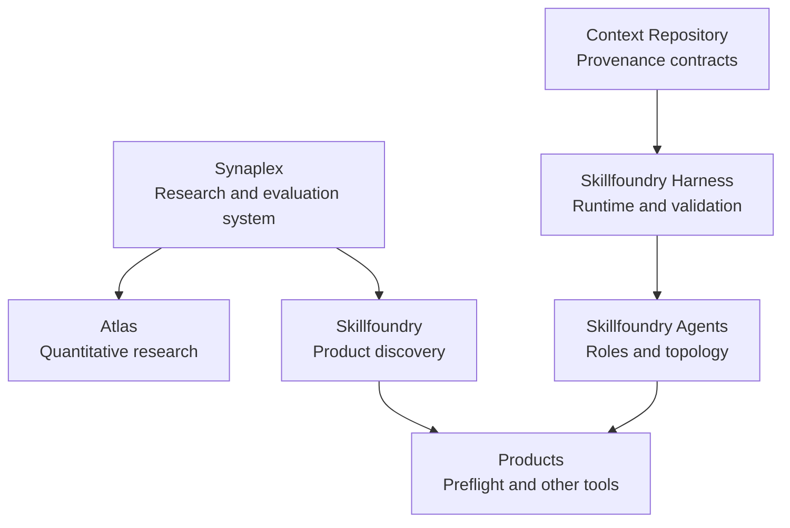

# Evan Follis, CFA

**AI systems architect building governed agent infrastructure, reproducible research systems, and quantitative decision tools.**

My work sits at the intersection of applied machine learning, investment research, agent architecture, and production engineering. I am especially interested in systems that remain inspectable, falsifiable, and useful after the initial demonstration.

Based in Nashville, Tennessee.

[LinkedIn](https://www.linkedin.com/in/evan-follis/) · [Synaplex](https://synaplex.ai)

## Start here

| If you want to see... | Start with | Status |
|---|---|---|
| Rigorous quantitative research | [Atlas](https://github.com/evanfollis/atlas) | Active research |
| A working public developer tool | [Preflight](https://github.com/evanfollis/preflight) | Public product |
| A full-stack AI application | [AI Mentor](https://github.com/evanfollis/mentor) | Deployed project |
| My broader AI-systems thesis | [Synaplex](https://github.com/evanfollis/synaplex) | In development |
| Agent runtime engineering | [Skillfoundry Harness](https://github.com/evanfollis/skillfoundry-harness) | Active infrastructure |
| Provenance and durable context | [Context Repository](https://github.com/evanfollis/context-repository) | Specification and pattern lab |

## Selected work

### [Atlas](https://github.com/evanfollis/atlas)

A causal research engine for pre-registered hypotheses, experiments, typed evidence, and explicit **promote / kill / continue / pivot** decisions.

Atlas currently applies the framework to crypto-market microstructure. Its research record includes positive findings, failed hypotheses, out-of-sample tests, backtests, event studies, and the methodological lessons produced by negative results.

### [Preflight](https://github.com/evanfollis/preflight)

A public MCP and REST tool that checks whether an MCP server is ready for the MCP Registry, Smithery, and npm. Findings are evidence-backed, source-linked, and paired with concrete fixes.

### [AI Mentor](https://github.com/evanfollis/mentor)

A full-stack architecture-learning system with a Next.js interface, FastAPI backend, PostgreSQL, Redis, Slack integration, adaptive quizzes, spaced repetition, and gated progression.

### [Synaplex](https://github.com/evanfollis/synaplex)

A system for studying AI systems through reproducible evaluations, reviewed evidence, and durable claims. Atlas and Skillfoundry act as applied research and product-development probes within the broader system.

## How the projects fit together

## Working principles

- Evidence before narrative.
- Point-in-time evaluation over retrospective fit.
- Explicit promotion and rejection criteria.
- Durable artifacts over ephemeral agent state.
- Clear boundaries between claims, evidence, policy, and decisions.
- Complexity only when it survives comparison with a simpler baseline.
- Negative results are part of the product.

## Background

CFA charterholder and AI systems architect with experience across asset management, fixed income, quantitative modeling, LLM systems, and production engineering.

Primary tools include Python, SQL, FastAPI, Docker, TypeScript, Next.js, applied ML, retrieval systems, structured LLM workflows, and agent infrastructure.

## Contact

The best place to reach me professionally is [LinkedIn](https://www.linkedin.com/in/evan-follis/).
